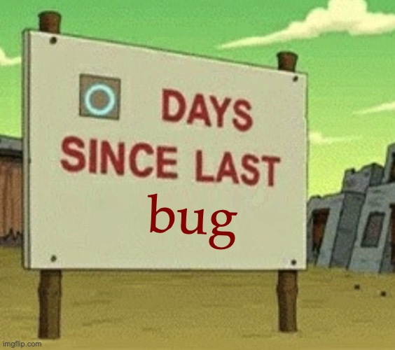

# 🌐 My Portfolio (V9 - UI Overhaul + Code Refactored)

Welcome to the repository for my personal developer portfolio!  

---

## 🚀 Features

- 🎨 **Animated & Interactive UI** – Smooth, modern animations enhance user engagement.  
- 👤 **Profile Page** – A dedicated section sharing my background and journey.  
- 🧩 **Project Showcase** – Explore my work through interactive tiles with real-time links.  
- 📬 **Contact Form** – Validated form for seamless communication.  
- 📱 **Fully Responsive** – Optimized across all screen sizes and devices.  
- 🧼 **Clean & Minimalist Design** – Aesthetic and accessible interface.  
- 🧱 **Well-Structured Codebase** – Semantic HTML, scoped styles, and clear, maintainable comments.

---

## 🐞 Known Issues *(as of 1/12/2026*)

> 🛠️ Updates and improvements are made gradually :D!

---

## 📋 Bug Tracking & Workflow

All issues and tasks are tracked via **JIRA** for a structured development process:

- Tasks prioritized for impact and urgency  
- Continuous improvement through regular reviews  

> 🔒 *Note: The JIRA board is private, but it mirrors a professional agile workflow.*
